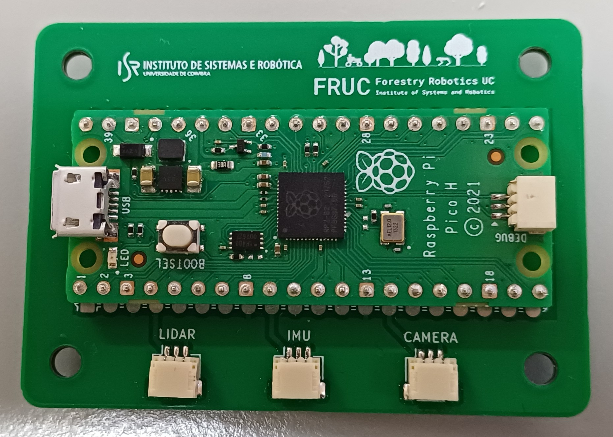
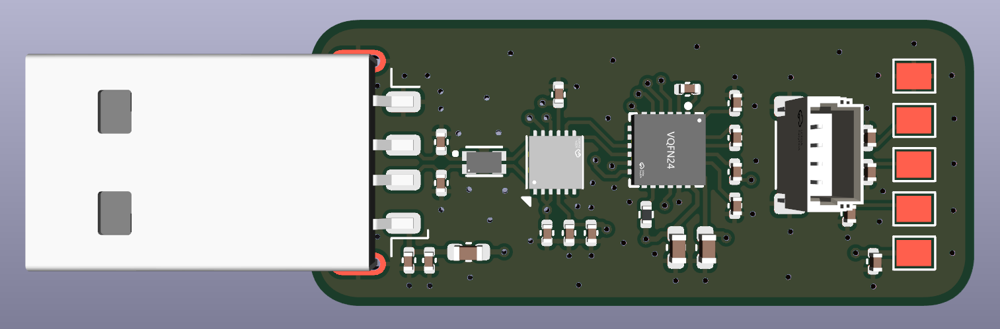
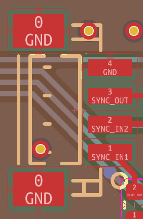

# FRUC PHYSICAL SENSOR TIME SYNCHRONIZATION UTILITIES

This repository contains all content necessary regarding the data collection time synchronization solutions used by the FRUC team on the collection and processing of their datasets. It includes both the PCB boards used during data collection, as well as the post processing script used for each bag captured to fix each message timestamp accordingly

## Custom Boards

The `Designs/` folder contains production-ready files for the two auxiliary boards used during data collection. These files are compatible with majority of manufacturers, but were particularly designed to use with [JLCPCB](jlcpcb.com)

Inside the root of each board's design folder is a `.pdf` schematic, a 3D `.step` file and the images present in this README. Furthermore, there are also two folders:

- `ProductionFiles/`, which contains:
  - Gerber files `.zip` archive
  - Bill of Materials in `.xlsx` format (for PCB assembly only)
  - Component Placement File in `.csv` format (for PCB assembly only)
- `DesignFiles/` which contains the full KiCAD EDA software project files ready to open and edit. [KiCAD](https://www.kicad.org/) is a free open-source PCB design software, which can be downloaded [here](https://www.kicad.org/download/). To open a design, simply open the `.pro` file. The KiCAD project should automatically detect the `Libraries/` folder and use the respective design components

### 1) FRUC Timesync Board

Simple PCB board using a soldered Raspberry Pico in the center, used to generate a total of three individually customizable PWM signals, using a custom firmware also found in this repository. These signals are routed via GPIO pins 2, 6 and 10, to standard JST-SH 3-pin connectors, using pins 1 (left) and 3 for signal and GND respectively

The pre-compiled custom firmware present in this repository outputs the following PWM signals in each connector:

- **LIDAR** - 1Hz (GPIO 2)
- **IMU** - 1Hz (GPIO 6)
- **CAMERA** - 30Hz (GPIO 10)



#### How to flash the Raspberry Pico with custom firmware

1. Press and hold the BOOTSEL button, and connect the board to a computer via USB
2. The board will appear as a mass storage device named RPI-RP2
3. Drag the `pico_pwm_generator.uf2` file from `Scripts/PWM_Generator/` to the device
4. The device will automatically restart and disconnect from USB, with the firmware running on it

#### Firmware compilation from source

For ease of use, the `.uf2` binary file is already provided in this repository ready to flash the board, but in case a compile from source is needed, please follow the [Raspberry Pi C/C++ SDK repository](https://github.com/raspberrypi/pico-sdk) README and documentation, using the provided CMake files also found in the same folder as the compiled binary

### 2) Xsens USB Converter Replica

Replica of a UART to USB converter board with exposed copper pads at the end where an Xsens MTi 600-series compatible cable can be soldered ([CA-MP-12-OPEN](https://www.digikey.com/en/products/detail/xsens-a-movella-brand/CA-MP-12-OPEN/12702430)). Contains a standard JST-SH 4-pin connector for full control over the SYNC lines



#### Soldering information and wire matching

Only 10 out of the 12 exposed wires from the aforementioned cable are soldered to the custom board. The original cable pinout can be found [here](https://mtidocs.movella.com/starter-kit$ca-mp-12-open). The pad layout marked in the figure (pads 1 to 5 are in the front of the board, 6 to 10 are in the back) is as follows, using the same naming scheme from the cable pinout:

1. `VIN` (wire 5)
2. `SYNC_IN1` (wire 3)
3. `SYNC_IN2` (wire 4)
4. `SYNC_OUT` (wire 11)
5. `GND` (wires 10 and 12)
6. `RS232_CTS` (wire 6)
7. `RS232_RxD` (wire 7)
8. `RS232_RTS` (wire 9)
9. `RS232_TxD` (wire 8)
10. `GND` (wires 10 and 12)

#### Sync lines pinout

The pinout order for the SYNC lines JST-SH connector can be seen in the image below



## Bag Post Processing Script

For accurate bag processing, the messages in the recorded bags needs to have both the header and record timestamp as close to the actual physical capture time as possible. This does not happen by default during capture, so all recorded bags need to be subject to a post processing to fix this

To do so, a `Python/ROS2` script is used, located in `Scripts/Bag_Processing/`. As the script uses ROS2 packages and libraries, it needs to be run inside a ROS2 environment. A ready to use Dockerized version of both ROS2 Humble and Jazzy distros are present in `Docker/ROS2`, containing both a `.Dockerfile` to build each image, and a Compose `.yml` file to create and launch a container for each distro, create the folder bindings, etc.

If you do not have the Docker Engine installed, following the install guide [here](https://github.com/Forestry-Robotics-UC/docker_ros_tutorial)

### Building the image and launching the container

Firstly, the image needs to be built using the provided Dockerfile. Change directory to inside the `Dockerfile` folder, and run the following command, replacing distro with either `humble` or `jazzy`:

```
docker build -f ros2_{distro}.Dockerfile -t ros2_{distro}_docker:latest .
```

Once finished, create and launch the container using Docker Compose. Change directory back to the root `ROS2` folder, and run the following command:

```
docker compose up
```

Once the container is up, to enter it, run the following command:

```
docker exec -it ros2_{distro}_docker bash
```

### Building the sensor packages/libraries

ROS2 does not natively come with some of the sensor packages used by the FRUC team. Luckily, all of these packages are already cloned and present in the `src/` folder, which is mounted as a volume inside the container via the Compose file

As such, upon the first time inside the container, change directory into `ros2_ws/`, and run the following commands:

```
colcon build
source install/setup.bash
```

Once finished, all packages are installed and ready to be used by the post processing script

### How to run the post processing script

The script supports input arguments, which are used to receive the bag folder path to process. As such, to run the script, use the following command:

```
python3 bag_processor.py <relative_bag_path_file>
```

The script will then read the bag folder, and process every single bagfile inside by numerical order, with support for bags split into multiple files. This file order is retained on the post-processed bag. The corrected bag will be found in a folder next to the original bag path, with the same name as the original and `_Corrected` appended at the end

Not all topics are subject to post processing, but for all the ones that are, the messages are published in a new topic with the same name as the original one but with `/corrected` at the end

Once a bag is processed, it needs to be manually re-indexed. To do so, run the following command inside the container:

```
ros2 bag reindex <relative_bag_path_file>
```

This will generate a new `metadata.yaml` file, however, the relative file paths at the end of this file are out of order, so it is recommended for the user to manually re-order the entries in numerical order

**NOTE: Depending on the distro used, the script may or not require topic ID to be used when creating the topic metadata. As such, when running the script in ROS2 Humble, make sure line 67 is commented, and uncommented in ROS2 Jazzy**

### Timestamp corrections routine per sensor

Since each sensor uses a different ROS2 SDK/wrapper, these handle timestamps and headers differently. As such, the script requires a handling routine per each sensor, explained below:

#### 1) RS-Bpearl LiDAR

Messages from this LiDAR sensor are simply the UDP packets received, which come at such a high frequency that the header epoch nanosecond timestamp is accurate enough to simply be re-used as the recording timestamp

#### 2) Ouster LiDAR and IMU

Unlike the previous LiDAR, messages here are in point cloud format, converted by the sensor's own SDK. Since there is a small fluctuation between the actual physical difference between frame capture times and the header times available, timestamp correction here is performed based on an initial reference time

To do so, on the very first message, the internal counter timestamp (time since boot) and the header timestamp are linked in the script. For each subsequent message from this sensor, the delta between the internal counter timestamps is calculated, as this is the most accurate time source present. This delta is added to the reference header timestamp (in epoch format), and this resulting timestamp replaces both the message header, and the recording timestamp

#### 3) Realsense Color Camera

The RealSense camera provides detailed metadata regarding each frame in a separate topic, useful to estimate the physical capture begin timestamp as close as close as possible

As such, metadata and frame messages are decoded in pairs, and a parameter from the metadata is used, called `frame_timestamp`, which is the moment where the first USB chunk was sent from the camera to the USB host. It is not the exact capture moment, but it is the closest timestamp available to such instance

#### 4) Realsense Depth Camera

The metadata from the depth camera provides even more detail that allows for an even more accurate capture instant calculation. Besides the `frame_timestamp` metadata parameter, there is also a parameter named `actual_exposure`, which is the total time in microseconds that the frame capture took

By subtracting this value to the `frame_timestamp`, and further subtracting 1ms (by visual inspection it was determined that this 1ms was around the delay between end of exposure and first USB chunk sent), we get a timestamp within half a milisecond from the actual physical exposure begin instance

This calculated value then replaces both the header and record timestamps

#### 5) Xsens IMU and Magnetometer

For this sensor, a reference time based timestamp correction is also performed, but it is done during bag recording, meaning that post processing consists only of replacing the record timestamp with the already accurate header timestamp
